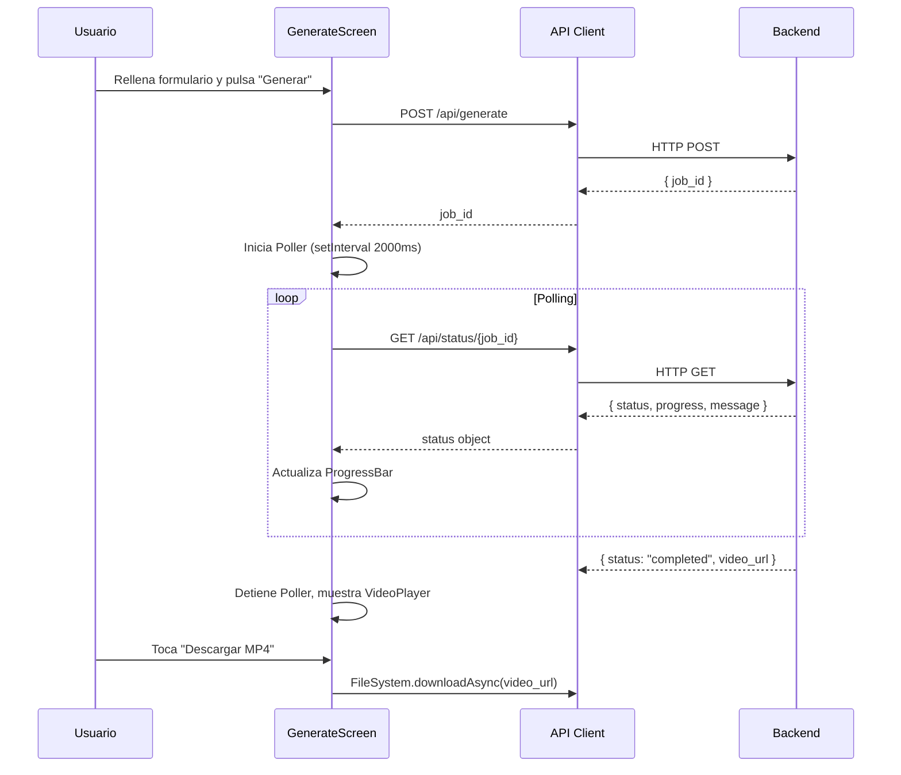

# Design Document: Mobile App — TikTok AI Studio

## Overview

App móvil nativa para Android e iOS construida con **React Native + Expo SDK 52** que replica y extiende la funcionalidad del frontend web existente. La app se conecta al backend FastAPI en `https://tiktok-ai-studio.onrender.com` y reutiliza la misma lógica de negocio: generación de videos con IA, polling de estado, biblioteca de videos y descarga/compartir.

El proyecto vive en `mobile/` en la raíz del repositorio, completamente independiente del frontend web (`frontend/`).

### Decisiones de diseño clave

- **Expo Router** (file-based routing) en lugar de React Navigation manual — reduce boilerplate y alinea con la convención moderna de Expo.
- **axios** para HTTP — consistente con el frontend web, permite interceptores para manejo centralizado de errores y timeouts diferenciados.
- **expo-av** para reproducción de video — librería oficial de Expo con soporte nativo en Android e iOS.
- **useState/useEffect** para estado local — la app no requiere estado global complejo; cada pantalla gestiona su propio estado.
- **No Redux/Zustand** — el scope de la app (2 pantallas) no justifica un store global.

---

## Architecture

```
mobile/
├── app/                          # Expo Router — file-based routing
│   ├── _layout.tsx               # Root layout (Stack + StatusBar)
│   └── (tabs)/
│       ├── _layout.tsx           # Tab bar layout
│       ├── index.tsx             # Generate Screen (tab "Crear")
│       └── library.tsx           # Library Screen (tab "Biblioteca")
├── components/
│   ├── AppHeader.tsx             # Header con logo TikTok AI
│   ├── ProgressBar.tsx           # Barra de progreso con gradiente
│   ├── VideoPlayer.tsx           # Reproductor expo-av
│   ├── VideoCard.tsx             # Tarjeta de video para biblioteca
│   ├── FormSelector.tsx          # Selector estilo picker
│   └── ToggleGroup.tsx           # Botones toggle (duración/idioma)
├── lib/
│   ├── api.ts                    # API client (axios)
│   └── constants.ts              # Colores, URLs, constantes
├── app.json                      # Configuración Expo
├── package.json
├── tsconfig.json
└── .env                          # Variables de entorno (gitignored)
```

### Flujo de datos



---

## Components and Interfaces

### API Client (`lib/api.ts`)

```typescript
const BASE_URL = process.env.EXPO_PUBLIC_API_URL ?? 'https://tiktok-ai-studio.onrender.com'

// Instancia para generación (timeout largo: 5 min)
const generateApi = axios.create({ baseURL: BASE_URL, timeout: 300_000 })

// Instancia para el resto de endpoints (timeout corto: 10s)
const api = axios.create({ baseURL: BASE_URL, timeout: 10_000 })

export interface VideoRequest {
  topic: string
  style: string
  audience: string
  duration: number
  language: string
  voice: string
  add_subtitles: boolean
  niche: string
}

export interface JobStatus {
  status: 'pending' | 'running' | 'completed' | 'error'
  progress: number
  message: string
  video_url?: string
  script?: { title: string; narration: string; hook?: string }
}

export interface VideoItem {
  filename: string
  url: string
  size_mb: number
}

export const generateVideo = (data: VideoRequest): Promise<{ job_id: string }>
export const getJobStatus = (jobId: string): Promise<JobStatus>
export const listVideos = (): Promise<{ videos: VideoItem[] }>
export const deleteVideo = (filename: string): Promise<void>
export const getVideoUrl = (url: string): string  // resuelve URLs relativas
```

**Manejo de errores centralizado** — interceptor de respuesta en ambas instancias:
- Timeout → mensaje "La solicitud tardó demasiado. Verifica tu conexión e intenta de nuevo."
- HTTP error → extrae `response.data.detail` o usa mensaje genérico de fallback.

### AppHeader (`components/AppHeader.tsx`)

Header fijo en todas las pantallas con logo degradado (ícono + texto "TikTok AI"). Recibe `title?: string` para subtítulo opcional.

### ProgressBar (`components/ProgressBar.tsx`)

```typescript
interface ProgressBarProps {
  progress: number   // 0–100
  message: string
}
```

Barra con gradiente `#fe2c55 → #25f4ee` usando `expo-linear-gradient`. Muestra porcentaje y mensaje.

### VideoPlayer (`components/VideoPlayer.tsx`)

```typescript
interface VideoPlayerProps {
  uri: string
  style?: StyleProp<ViewStyle>
}
```

Wrapper sobre `expo-av` `Video` con controles nativos (`useNativeControls`), contenedor redondeado (borderRadius 12), fondo negro.

### VideoCard (`components/VideoCard.tsx`)

```typescript
interface VideoCardProps {
  video: VideoItem
  onDelete: (filename: string) => void
  onShare: (filename: string) => void
}
```

Tarjeta con VideoPlayer, nombre de archivo, tamaño en MB, botones de descarga, compartir y eliminar.

### FormSelector (`components/FormSelector.tsx`)

```typescript
interface FormSelectorProps {
  label: string
  value: string
  options: Array<{ value: string; label: string }>
  onChange: (value: string) => void
}
```

Picker nativo envuelto en un contenedor estilizado con borde `#2a2a2a` y fondo `#1a1a1a`.

### ToggleGroup (`components/ToggleGroup.tsx`)

```typescript
interface ToggleGroupProps {
  options: Array<{ value: string; label: string }>
  value: string
  onChange: (value: string) => void
  activeColor?: string   // default: '#fe2c55'
  activeTextColor?: string  // default: '#ffffff'
}
```

---

## Data Models

### Estado local — GenerateScreen

```typescript
interface GenerateFormState {
  topic: string          // max 200 chars
  style: string          // 'entretenido' | 'educativo' | 'motivacional' | 'humor' | 'misterio' | 'viral'
  audience: string       // 'general' (fijo, mapeado a niche)
  duration: number       // 15 | 30 | 60
  language: string       // 'es' | 'en'
  voice: string          // 'edge' | 'gtts'
  add_subtitles: boolean
  niche: string          // 'general' | 'fitness' | 'tecnologia' | ...
}

interface GenerateScreenState {
  form: GenerateFormState
  jobId: string | null
  jobStatus: JobStatus | null
  loading: boolean
  error: string | null
}
```

### Estado local — LibraryScreen

```typescript
interface LibraryScreenState {
  videos: VideoItem[]
  loading: boolean
  deleting: string | null      // filename en proceso de eliminación
  confirmDelete: string | null // filename pendiente de confirmación
  error: string | null
}
```

### Constantes (`lib/constants.ts`)

```typescript
export const COLORS = {
  background: '#010101',
  primary: '#fe2c55',
  secondary: '#25f4ee',
  textPrimary: '#ffffff',
  textSecondary: '#aaaaaa',
  cardBg: '#1a1a1a',
  border: '#2a2a2a',
  tabInactive: '#555555',
  tabBorder: '#1a1a1a',
}

export const STYLES_OPTIONS = ['entretenido','educativo','motivacional','humor','misterio','viral']
export const NICHE_OPTIONS = ['general','fitness','tecnologia','negocios','humor','educacion','lifestyle','salud','viajes','cocina']
export const DURATION_OPTIONS = [15, 30, 60]
export const VOICE_OPTIONS = [{ value: 'edge', label: 'Edge TTS' }, { value: 'gtts', label: 'Google TTS' }]
```

### Configuración — `app.json`

```json
{
  "expo": {
    "name": "TikTok AI Studio",
    "slug": "tiktok-ai-studio",
    "version": "1.0.0",
    "scheme": "tiktok-ai-studio",
    "orientation": "portrait",
    "icon": "./assets/icon.png",
    "splash": { "backgroundColor": "#010101" },
    "android": {
      "adaptiveIcon": { "backgroundColor": "#010101" },
      "package": "com.tiktokaisudio.app"
    },
    "ios": {
      "bundleIdentifier": "com.tiktokaisudio.app",
      "supportsTablet": false
    },
    "plugins": ["expo-router", "expo-av"]
  }
}
```

### Configuración — `package.json` (dependencias clave)

```json
{
  "dependencies": {
    "expo": "~52.0.0",
    "expo-router": "~4.0.0",
    "expo-av": "~15.0.0",
    "expo-file-system": "~18.0.0",
    "expo-sharing": "~13.0.0",
    "expo-linear-gradient": "~14.0.0",
    "expo-status-bar": "~2.0.0",
    "axios": "^1.7.0",
    "react": "18.3.1",
    "react-native": "0.76.0",
    "@expo/vector-icons": "^14.0.0"
  }
}
```

---

## Correctness Properties

*A property is a characteristic or behavior that should hold true across all valid executions of a system — essentially, a formal statement about what the system should do. Properties serve as the bridge between human-readable specifications and machine-verifiable correctness guarantees.*

### Property 1: Tab active/inactive coloring

*For any* tab index in the tab bar, the active tab SHALL render with color `#fe2c55` and all other tabs SHALL render with color `#555555`.

**Validates: Requirements 2.3, 2.4**

---

### Property 2: Empty/whitespace topic disables submit

*For any* string composed entirely of whitespace characters (including the empty string), the submit button in GenerateScreen SHALL be disabled and no POST request SHALL be sent.

**Validates: Requirements 3.8**

---

### Property 3: Form submission payload completeness

*For any* valid form state (non-empty topic), submitting the form SHALL result in a POST request to `/api/generate` containing all required fields: `topic`, `style`, `audience`, `duration`, `language`, `voice`, `add_subtitles`, and `niche`.

**Validates: Requirements 3.9**

---

### Property 4: Progress bar renders any progress value

*For any* progress value between 0 and 100 and any non-empty message string, the ProgressBar component SHALL render the filled portion at exactly that percentage width and display the message text.

**Validates: Requirements 4.2**

---

### Property 5: Poller cleanup on unmount

*For any* active polling state (jobId set, interval running), unmounting the GenerateScreen SHALL always cancel the polling interval, preventing further API calls.

**Validates: Requirements 4.7**

---

### Property 6: Video card renders all required fields

*For any* list of VideoItem objects returned by the API, each rendered VideoCard SHALL display a video player, the filename string, and the size in MB.

**Validates: Requirements 6.4**

---

### Property 7: Delete removes video from list

*For any* video present in the library list, confirming its deletion SHALL result in a DELETE request to `/api/videos/{filename}` and that video SHALL no longer appear in the rendered list.

**Validates: Requirements 6.7**

---

### Property 8: HTTP error message extraction

*For any* HTTP error response from the backend, the displayed error message SHALL be the `detail` field from the response body if present, or the fallback message "Error al iniciar la generación" / "Error al eliminar el video" if `detail` is absent.

**Validates: Requirements 8.4**

---

### Property 9: Video URL resolution

*For any* URL string passed to `getVideoUrl`, the returned value SHALL be an absolute URL starting with `http://` or `https://` — prepending the backend base URL for relative paths.

**Validates: Requirements 8.5**

---

## Error Handling

### Estrategia por capa

| Capa | Error | Comportamiento |
|------|-------|----------------|
| API Client | Timeout en `/api/generate` (>5 min) | Mensaje: "La solicitud tardó demasiado. Verifica tu conexión e intenta de nuevo." |
| API Client | Timeout en otros endpoints (>10s) | Mismo mensaje de timeout |
| API Client | HTTP 4xx/5xx | Extrae `response.data.detail` o usa fallback |
| GenerateScreen | POST `/api/generate` falla | Muestra error inline bajo el formulario |
| GenerateScreen | Polling falla (network error) | Detiene poller, muestra "Error al consultar el estado del video" |
| GenerateScreen | Descarga falla | Alert: "Error al descargar el video" |
| LibraryScreen | GET `/api/videos` falla | Muestra error inline con botón de reintento |
| LibraryScreen | DELETE falla | Alert: "Error al eliminar el video" |

### Interceptor de axios

```typescript
// Aplicado a ambas instancias (api y generateApi)
instance.interceptors.response.use(
  (response) => response,
  (error) => {
    if (error.code === 'ECONNABORTED') {
      return Promise.reject(new Error('La solicitud tardó demasiado. Verifica tu conexión e intenta de nuevo.'))
    }
    const detail = error.response?.data?.detail
    return Promise.reject(new Error(detail ?? error.message ?? 'Error desconocido'))
  }
)
```

### Cleanup de recursos

El Poller usa `useRef` para almacenar el `intervalId` y un `useEffect` con función de cleanup:

```typescript
useEffect(() => {
  if (!jobId) return
  const id = setInterval(poll, 2000)
  pollRef.current = id
  return () => clearInterval(id)  // cleanup garantizado en unmount
}, [jobId])
```

---

## Testing Strategy

### Herramientas

- **Jest** + **@testing-library/react-native** — tests unitarios y de componentes
- **fast-check** — property-based testing (PBT)
- **jest-expo** — preset de Jest para Expo

### Tests unitarios (ejemplos y casos borde)

Cubren comportamientos específicos que no se prestan a PBT:

- `AppHeader` renderiza logo y título correctamente
- `FormSelector` muestra todas las opciones del picker
- `ToggleGroup` aplica estilos activos/inactivos correctamente
- `VideoPlayer` renderiza componente `Video` de expo-av
- `GenerateScreen` deshabilita botón cuando topic está vacío (ejemplo concreto)
- `GenerateScreen` muestra error cuando POST falla (mock axios)
- `GenerateScreen` detiene polling cuando status es `completed`
- `GenerateScreen` detiene polling cuando status es `error`
- `LibraryScreen` muestra spinner durante carga
- `LibraryScreen` muestra empty state cuando lista está vacía
- `LibraryScreen` muestra modal de confirmación al pulsar eliminar
- `api.ts` usa timeout 300000ms para generateApi
- `api.ts` usa timeout 10000ms para api

### Tests de propiedades (property-based)

Cada test usa **fast-check** con mínimo 100 iteraciones. Cada test referencia la propiedad del diseño en un comentario.

**Property 1 — Tab active/inactive coloring**
```
// Feature: mobile-app, Property 1: Tab active/inactive coloring
fc.assert(fc.property(fc.integer({ min: 0, max: 1 }), (activeTab) => {
  // render tab bar with activeTab, verify colors
}), { numRuns: 100 })
```

**Property 2 — Empty/whitespace topic disables submit**
```
// Feature: mobile-app, Property 2: Empty/whitespace topic disables submit
fc.assert(fc.property(fc.stringMatching(/^\s*$/), (whitespaceInput) => {
  // set topic to whitespaceInput, verify button is disabled
}), { numRuns: 100 })
```

**Property 3 — Form submission payload completeness**
```
// Feature: mobile-app, Property 3: Form submission payload completeness
fc.assert(fc.property(validFormArbitrary, (form) => {
  // submit form, verify POST called with all required fields
}), { numRuns: 100 })
```

**Property 4 — Progress bar renders any progress value**
```
// Feature: mobile-app, Property 4: Progress bar renders any progress value
fc.assert(fc.property(fc.integer({ min: 0, max: 100 }), fc.string({ minLength: 1 }), (progress, message) => {
  // render ProgressBar, verify width and message
}), { numRuns: 100 })
```

**Property 5 — Poller cleanup on unmount**
```
// Feature: mobile-app, Property 5: Poller cleanup on unmount
fc.assert(fc.property(fc.uuid(), (jobId) => {
  // mount with jobId, unmount, verify clearInterval called
}), { numRuns: 100 })
```

**Property 6 — Video card renders all required fields**
```
// Feature: mobile-app, Property 6: Video card renders all required fields
fc.assert(fc.property(fc.array(videoItemArbitrary, { minLength: 1 }), (videos) => {
  // render library with videos, verify each card has player, filename, size
}), { numRuns: 100 })
```

**Property 7 — Delete removes video from list**
```
// Feature: mobile-app, Property 7: Delete removes video from list
fc.assert(fc.property(fc.array(videoItemArbitrary, { minLength: 1 }), fc.nat(), (videos, idx) => {
  const target = videos[idx % videos.length]
  // confirm delete, verify DELETE called and video gone from list
}), { numRuns: 100 })
```

**Property 8 — HTTP error message extraction**
```
// Feature: mobile-app, Property 8: HTTP error message extraction
fc.assert(fc.property(httpErrorArbitrary, (errorResponse) => {
  const msg = extractErrorMessage(errorResponse)
  if (errorResponse.data?.detail) {
    return msg === errorResponse.data.detail
  }
  return msg === FALLBACK_MESSAGE
}), { numRuns: 100 })
```

**Property 9 — Video URL resolution**
```
// Feature: mobile-app, Property 9: Video URL resolution
fc.assert(fc.property(urlArbitrary, (url) => {
  const result = getVideoUrl(url)
  return result.startsWith('http://') || result.startsWith('https://')
}), { numRuns: 100 })
```

### Cobertura objetivo

- Componentes: ≥ 80% de líneas
- `lib/api.ts`: 100% de ramas (manejo de errores crítico)
- `getVideoUrl`: 100% (función pura, fácil de cubrir con PBT)
